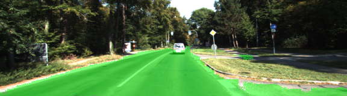

# Semantic Segmentation

### Introduction

This is my implementation of Semantic Segmentation project as part of Udacity Self Driving Car Nanodegree.  In this exercise I train a Fully Convolutional Network (FCN) to label each pixel of input image wether it shows part of road or not.

### Setup
##### Frameworks and Packages
Make sure you have the following is installed:
 - [Python 3](https://www.python.org/)
 - [TensorFlow](https://www.tensorflow.org/)
 - [NumPy](http://www.numpy.org/)
 - [SciPy](https://www.scipy.org/)
##### Dataset
Download the [Kitti Road dataset](http://www.cvlibs.net/datasets/kitti/eval_road.php) from [here](http://www.cvlibs.net/download.php?file=data_road.zip).  Extract the dataset in the `data` folder.  This will create the folder `data_road` with all the training a test images.

### Architecture
The FCW is based on VGG 16 pre-trained network.  FC layers at the end of the graph are removed and instead added following layers:

1. Connect layer 7 convolution output to 1x1 convolution, reducing number of matrix layers to 2
2. Add deconvolution layer to scale up the matrix.
3. Introduce skip layers by combining output of convolution layers 3 & 4 with result of step 2 for smoothing out region boundaries

### Results
Predictions of KITTI test dataset can be found at `runs` folder.

Some (of the better) samples are attached here:

